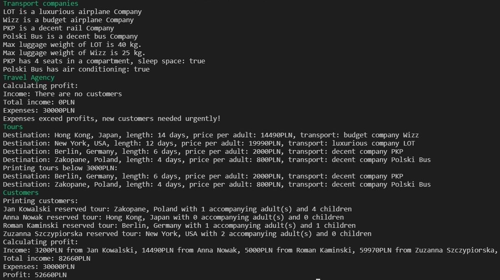
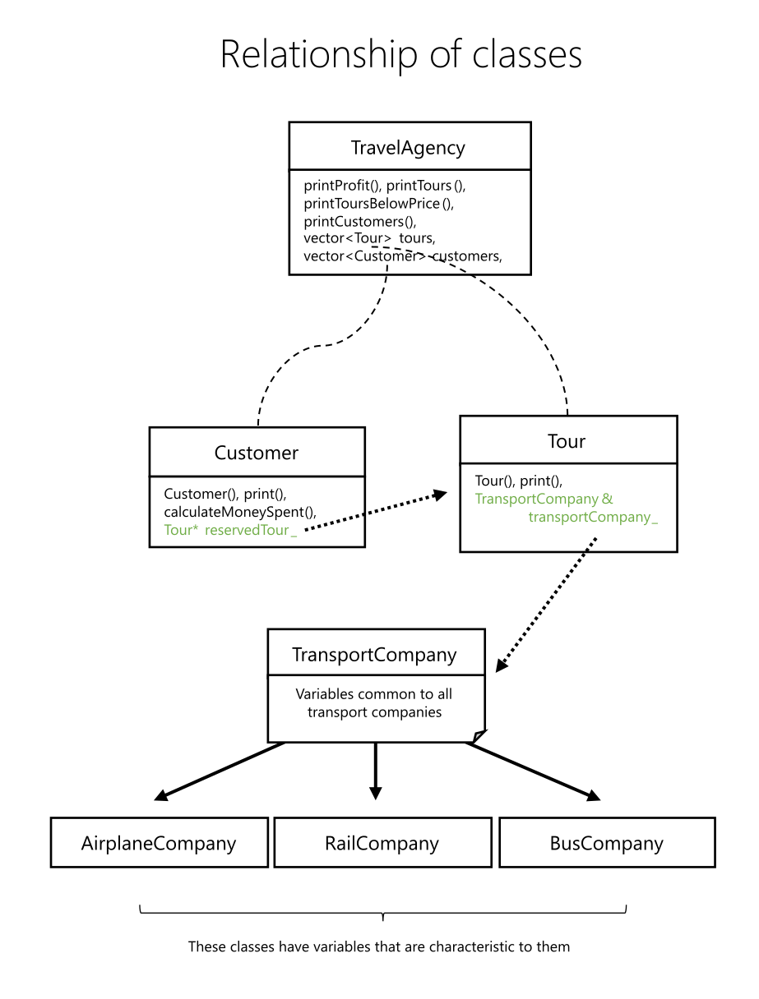

# Travel agency

*Project description was updated to reflect changes made to the codebase.*

## Introduction

This project consists of a C++ object oriented set of classes designed for usage at a travel agency.

Screenshot of the program with sample data run in the console can be seen below.



## Compilation
Given that g++ is installed, the program can be compiled with the following command:
```
g++ -std=c++17 -o travel-agency main.cpp transport.cpp travel_agency.cpp tour.cpp customer.cpp
```
and then run on Linux with:
```
.\travel-agency.out
```
or on Windows with:
```
.\travel-agency.exe
```

## Visualisation of classes



## Declaration of classes

### TravelAgency

TravelAgency is the central class in the hierarchy. Its most important elements are the STL containers pointing to designated class objects, namely:

- vector storing Customer objects
  ```cpp
  vector<Customer> customers;
  ```
- vector storing Tour objects
  ```cpp
  vector<Tour> tours;
  ```

The vector container was chosen because vector provides automatic space reallocation, which allows for adding new elements easily and takes less space than a list.

```cpp
class TravelAgency {
public:
    TravelAgency(string name, string countryOfOrigin, string internetDomain, int numberOfEmployees, int averageSalary);
    void printProfit() const; // prints sum of all customers' moneySpent - averageSalary * numOfEmployees
    void printTours() const;
    void printToursBelowPrice(int maxPrice) const; // prints tours with price under maxPrice
    void printCustomers() const;
    string getName() const;
    void setName(string name);
    string getCountryOfOrigin() const;
    void setCountryOfOrigin(string countryOfOrigin);
    string getInternetDomain() const;
    void setInternetDomain(string internetDomain);
    int getAverageSalary() const;
    void setAverageSalary(int averageSalary);
    int getNumberOfEmployees() const;
    void setNumberOfEmployees(int numberOfEmployees);
    vector<Customer> customers;
    vector<Tour> tours;

private:
    string name_;
    string countryOfOrigin_;
    string internetDomain_;
    int numberOfEmployees_;
    int averageSalary_;
};

```

### Customer

When a customer object is created, one of the parameters it is instantiated with is the pointer to tourReserved.

```cpp
Customer(string name, Tour* tourReserved, int numOfAccompanyingAdults, int numOfChildren);
```

This, as the name suggests links each of the customers with a tour they are to participate in. It also allows to calculate costs bore by each customer, which looks like this:

```cpp
int Customer::calculateMoneySpent()
{
    return (numberOfAccompanyingAdults_ + 1) * reservedTour_->getPricePerAdult()
        + numberOfChildren_ * reservedTour_->getPricePerAdult() * 0.5;
}
```

Here are the headers of this class.

```cpp
class Customer {
public:
    Customer(string name, Tour* reservedTour, int numberOfAccompanyingAdults, int numberOfChildren);
    void print();
    int calculateMoneySpent(); 
    string getName() const;
    void setName(string name);
    Tour* getReservedTour() const;
    void setReservedTour(Tour* reservedTour);
    int getNumberOfAccompanyingAdults() const;
    void setNumberOfAccompanyingAdults(int numberOfAccompanyingAdults);
    int getNumberOfChildren() const;
    void setNumberOfChildren(int numberOfChildren);

private:
    string name_;
    Tour* reservedTour_;
    int numberOfAccompanyingAdults_;
    int numberOfChildren_;
    int moneySpent_;
};
```

### Tour

The Tour class contains a pointer to one of the TransportCompany types:
`AirplaneCompany`, `RailCompany` or `BusCompany`.

Each of the tours has a main means of transport which is set in the constructor and can be changed later on.

```cpp
Tour(string destination, int lengthInDays, int pricePerAdult, TransportCompany& transportCompany);
```

Headers for Tour:

```cpp
class Tour {
public:
    Tour(string destination, int lengthInDays, int pricePerAdult, TransportCompany& transportCompany);
    void print();
    string getDestination() const;
    void setDestination(string destinations);
    int getLengthInDays() const;
    void setLengthInDays(int lengthInDays);
    int getPricePerAdult() const;
    void setPricePerAdult(int pricePerAdult);

private:
    string destination_;
    int lengthInDays_;
    int pricePerAdult_;
    TransportCompany& transportCompany_;
};
```

### TransportCompany: AirplaneCompany, RailCompany and BusCompany

Each mode of transport has a fundamentally different technological solution, thus characteristic variables. To meet these needs, a class `TransportCompany` which unities the common factors of transport was created with three subclasses inheriting from the above class and adding their own variables.

#### TransportCompany

```cpp
class TransportCompany {
public:
    TransportCompany(string name, int standard);
    string getName() const;
    void setName(string name);
    string getStandard() const;
    enum Standard { budget,
        decent,
        luxurious };
    void setStandard(TransportCompany::Standard standard);

protected:
    string name_;
    int standard_ = decent;
};
```

#### AirplaneCompany

```cpp
class AirplaneCompany : public TransportCompany {
public:
    AirplaneCompany(string name, int standard, int maxLuggageWeight);
    int getMaxLuggageWeight() const;
    void setMaxLuggageWeight(int maxLuggageWeight);
    const string TYPE = "airplane company";

private:
    int maxLuggageWeight_;
};
```

#### RailCompany

```cpp
class RailCompany : public TransportCompany {
public:
    RailCompany(string name, int standardLevel, int sleepSpace, int numOfSeatsInCompartment);
    bool hasSleepSpace() const;
    void setSleepSpace(bool hasSleepSpace);
    int getNumOfSeatsInCompartment() const;
    void setNumOfSeatsInCompartment(int numOfSeatsInCompartment);
    const string TYPE = "rail company";

private:
    bool sleepSpace_;
    int numOfSeatsInCompartment_;
};
```

#### BusCompany

```cpp
class BusCompany : public TransportCompany {
public:
    BusCompany(string name, int standardLevel, bool AC);
    bool hasAC() const;
    void setAC(bool AC);
    const string TYPE = "bus company";

private:
    bool AC_;
};
```

## Example usage

This is an exemplary main function content.

```cpp
    log("Transport companies");

    AirplaneCompany Lot("LOT", TransportCompany::luxurious, 40);
    AirplaneCompany Wizz("Wizz", TransportCompany::budget, 25);
    RailCompany Pkp("PKP", TransportCompany::decent, true, 4);
    BusCompany PolskiBus("Polski Bus", TransportCompany::decent, true);

    // variables common to all transport companies
    cout << Lot.getName() << " is a " << Lot.getStandard() << " " << Lot.TYPE << endl;
    cout << Wizz.getName() << " is a " << Wizz.getStandard() << " " << Wizz.TYPE << endl;
    cout << Pkp.getName() << " is a " << Pkp.getStandard() << " " << Pkp.TYPE << endl;
    cout << PolskiBus.getName() << " is a " << PolskiBus.getStandard() << " " << PolskiBus.TYPE << endl;

    // variables characteristic to airplane companies
    cout << "Max luggage weight of " << Lot.getName() << " is " << Lot.getMaxLuggageWeight() << " kg." << endl;
    cout << "Max luggage weight of " << Wizz.getName() << " is " << Wizz.getMaxLuggageWeight() << " kg." << endl;

    // rail & bus companies
    cout << boolalpha; // flag that makes bools display as true or false instead of 1 or 0.
    cout << Pkp.getName() << " has " << Pkp.getNumOfSeatsInCompartment() << " seats in a compartment, sleep space: "
         << Pkp.hasSleepSpace() << endl;
    cout << PolskiBus.getName() << " has air conditioning: " << PolskiBus.hasAC() << endl;

    log("Travel Agency");

    TravelAgency Horyzont("Horyzont", "Poland", "horyzont.io", 10, 3000);
    Horyzont.printProfit();

    log("Tours");

    Tour HongKong("Hong Kong, Japan", 14, 14490, Wizz);
    Tour NewYork("New York, USA", 12, 19990, Lot);
    Tour Berlin("Berlin, Germany", 6, 2000, Pkp);
    Tour Zakopane("Zakopane, Poland", 4, 800, PolskiBus);

    // Adding new tours to Horyzont.
    Horyzont.tours.push_back(HongKong);
    Horyzont.tours.push_back(NewYork);
    Horyzont.tours.push_back(Berlin);
    Horyzont.tours.push_back(Zakopane);

    Horyzont.printTours();

    Horyzont.printToursBelowPrice(3000); // prints tours with price under 3000PLN

    log("Customers");

    Customer customer1("Jan Kowalski", &Zakopane, 1, 3);
    Customer customer2("Anna Nowak", &HongKong, 0, 0);
    Customer customer3("Roman Kaminski", &Berlin, 1, 1);
    Customer customer4("Zuzanna Szczypiorska", &NewYork, 2, 0);

    customer1.setNumberOfChildren(4);

    Horyzont.customers.push_back(customer1);
    Horyzont.customers.push_back(customer2);
    Horyzont.customers.push_back(customer3);
    Horyzont.customers.push_back(customer4);

    Horyzont.printCustomers();

    Horyzont.printProfit();

```

## Miscellaneous  

This [C++ programming convention](http://geosoft.no/development/cppstyle.html) is utilized.

Code formatted using `Clang_format` with WebKit style.
