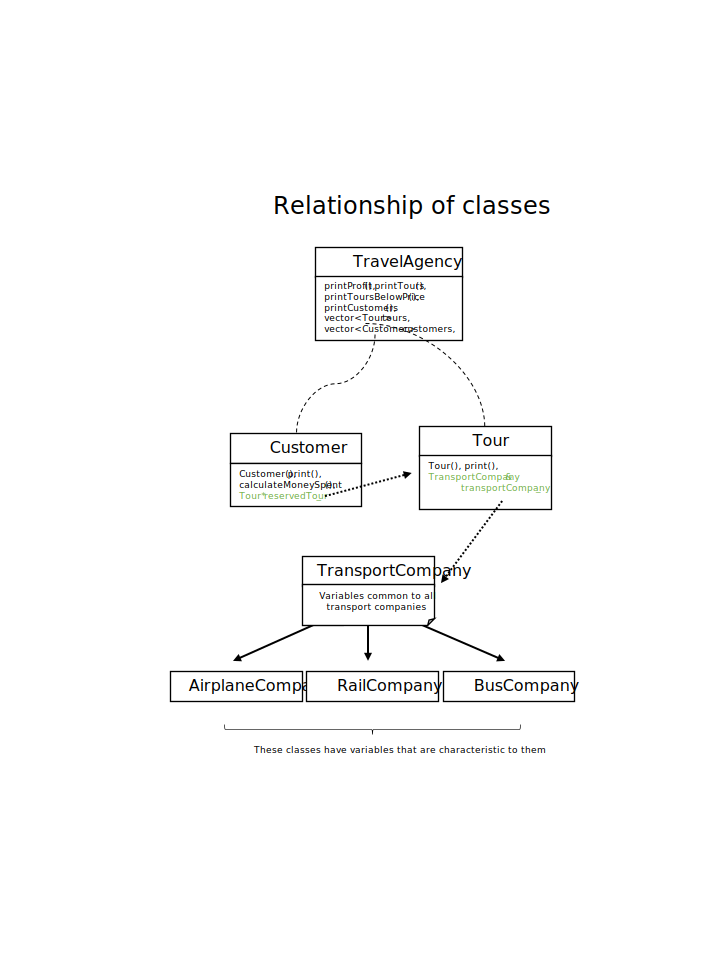

# Travel agency

## Description of the project

This project consists of a C++ object oriented set of classes designed for usage at a travel agency.

## Visualisation of classes



## Declaration of classes

### TravelAgency

TravelAgency is the central class in the hierarchy. Its most important elements are the STL containers pointing to designated class objects, namely:

- vector pointing to Customer objects
  ```cpp
  vector<Customer*> customers;
  ```
- list pointing to Tour objects
  ```cpp
  list<Tour*> tours;
  ```

The vector container was chosen for storing customer list because vector provides automatic space reallocation, which allows for adding new elements easily and takes less space than a list.

For storing list of tours, an STL list was decided on, as it allows for easier adding of elements in between the existing ones, than vector, which is vital, as tours are added to the right position depending upon their price. (The list is sorted in ascending order by price all the time)

```cpp
class TravelAgency {
public:
    int calculateProfit(); // returns sum of all customers' moneySpent - averageSalary * numOfEmployees
    void printToursBelowPrice(int maxPrice); // prints tours with price under maxPrice
    string getCountryOfOrigin();
    void setCountryOfOrigin(string countryOfOrigin);
    string getInternetDomain();
    void setInternetDomain(string internetDomain);
    int getAvgSalary();
    void setAvgSalary(int avgSalary);
    int getNumOfEmployees();
    void setNumOfEmployees(int numOfEmployees);
    vector<Customer*> customers;
    list<Tour*> tours;

private:
    string countryOfOrigin;
    string internetDomain;
    int avgSalary;
    int numOfEmployees;
};
```

### Customer

When a customer object is created, one of the parameters it is instantiated with is the pointer to tourReserved.

```cpp
Customer(string name, Tour* tourReserved, int numOfAccompanyingAdults, int numOfChildren);

```

This, as the name suggests links each of the customers with a tour they are to participate in. It also allows to calculate costs bore by each customer, which will look more less like this:

```cpp
int calculateMoneySpent {
    return (numOfAccompanyingAdults + 1) * &tourReserved->pricePerAdult + numOfChildren * &tourReserved->pricePerAdult * 0.5;
}
```

Here are the headers of this class.

```cpp
class Customer {
public:
    Customer(string name, Tour* tourReserved, int numOfAccompanyingAdults, int numOfChildren);
    ~Customer();
    void print();
    int calculateMoneySpent();
    string getName() const;
    void setName(string name);
    Tour* getReservedTour() const;
    void setReservedTour(Tour* tourReserved);
    int GetNumOfAccompanyingAdults() const;
    void SetNumOfAccompanyingAdults(int numOfAccompanyingAdults);
    int GetNumOfChildren() const;
    void SetNumOfChildren(int numOfChildren);

private:
    string name;
    Tour* reservedTour;
    int numOfAccompanyingAdults;
    int numOfChildren;
    int moneySpent;
};
```

### Tour

The Tour class contains a pointer to one of the TransportCompany types:
`AirplaneCompany`, `RailCompany` or `BusCompany`.

Each of the tours has a main means of transport which is set in the constructor and can be changed later on.

```cpp
Tour(string destinations, int lengthInDays, int pricePerAdult, TransportCompany transportCompany);
```

Headers for Tour:

```cpp

class Tour {
public:
    Tour(string destinations, int lengthInDays, int pricePerAdult, TransportCompany* transportCompany);
    ~Tour();
    void print();
    vector<string> getDestinations() const;
    void setDestinations(vector<string> destinations);
    int getLengthInDays() const;
    void setLengthInDays(int lengthInDays);
    int getPricePerAdult() const;
    void setPricePerAdult(int pricePerAdult);

private:
    string destinations;
    int lengthInDays;
    int pricePerAdult;
    TransportCompany transportCompany;
};
```

### TransportCompany: AirplaneCompany, RailCompany and BusCompany

Each mode of transport has a fundamentally different technological solution, thus characteristic variables. To meet these needs, a class `TransportCompany` which unities the common factors of transport was created with three subclasses inheriting from the above class and adding their own variables.

#### TransportCompany

```cpp
class TransportCompany {
public:
    TransportCompany(string name, int standardLevel);
    int getStandard();
    enum Standard { budget,
        decent,
        luxurious };
    int setStandard(TransportCompany::Standard standard);

protected:
    string name;
    int standardLevel = decent;
};
```

#### AirplaneCompany

```cpp
class AirplaneCompany : public TransportCompany {
public:
    AirplaneCompany(string name, int standardLevel, int maxLuggageWeight);
    int GetMaxLuggageWeight();
    void SetMaxLuggageWeight(int maxLuggageWeight);

private:
    int maxLuggageWeight;
};
```

#### RailCompany

```cpp
class RailCompany : public TransportCompany {
public:
    RailCompany(string name, int standardLevel, int isSleepSpaceProvided, int numOfSeatsInCompartment);
    bool GetIsSleepSpaceProvided();
    void SetIsSleepSpaceProvided(bool isSleepSpaceProvided);
    int GetNumOfSeatsInCompartment() const;
    void SetNumOfSeatsInCompartment(int numOfSeatsInCompartment);

private:
    bool isSleepSpaceProvided;
    int numOfSeatsInCompartment;
};
```

#### BusCompany

```cpp
class BusCompany : public TransportCompany {
public:
    BusCompany(string name, int standardLevel, bool hasAC);
    bool GetHasAC() const;
    void SetHasAC(bool hasAC);

private:
    bool hasAC;
};
```

## Example usage

This is an exemplary main function content.

```cpp
// Transport

AirplaneCompany Lot("LOT", TransportCompany::luxurious, 40);
AirplaneCompany Wizz("Wizz", TransportCompany::budget, 40);
RailCompany Pkp("PKP", TransportCompany::decent, true, 4);
BusCompany PolskiBus("PolskiBus", TransportCompany::decent, true);

// Travel agency

TravelAgency Horyzont;

// Tours

Tour HongKong("Hong Kong, Japan", 14, 14490, &Wizz);
Tour NewYork("New York, USA", 12, 19990, &Lot);
Tour Berlin("Berlin, Germany", 6, 2000, &Pkp);
Tour Zakopane("Zakopane, Poland", 4, 800, &PolskiBus);

Horyzont.tours.push_back(&HongKong);
Horyzont.tours.push_back(&NewYork);
Horyzont.tours.push_back(&Berlin);
Horyzont.tours.push_back(&Zakopane);

Horyzont.printToursBelowPrice(3000); // In PLN

// Customers

Customer customer1("Jan Kowalski", &Zakopane, 1, 3);
Customer customer2("Anna Nowak", &HongKong, 0, 0);
Customer customer3("Roman Kaminski", &Berlin, 1, 1);
Customer customer4("Zuzanna Szczypiorska", &NewYork, 2, 0);

Horyzont.customers.push_back(&customer1);
Horyzont.customers.push_back(&customer2);
Horyzont.customers.push_back(&customer3);
Horyzont.customers.push_back(&customer4);

customer1.SetNumOfChildren(4);

// Travel agency

cout << Horyzont.calculateProfit() << endl;
```

## Others

This [C++ programming convention](http://geosoft.no/development/cppstyle.html) is utilized.

Code formatted using `Clang_format` with WebKit style.
