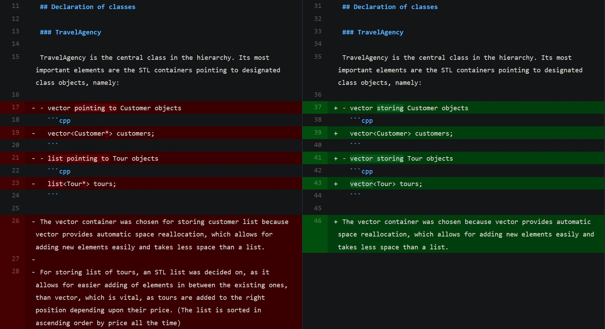
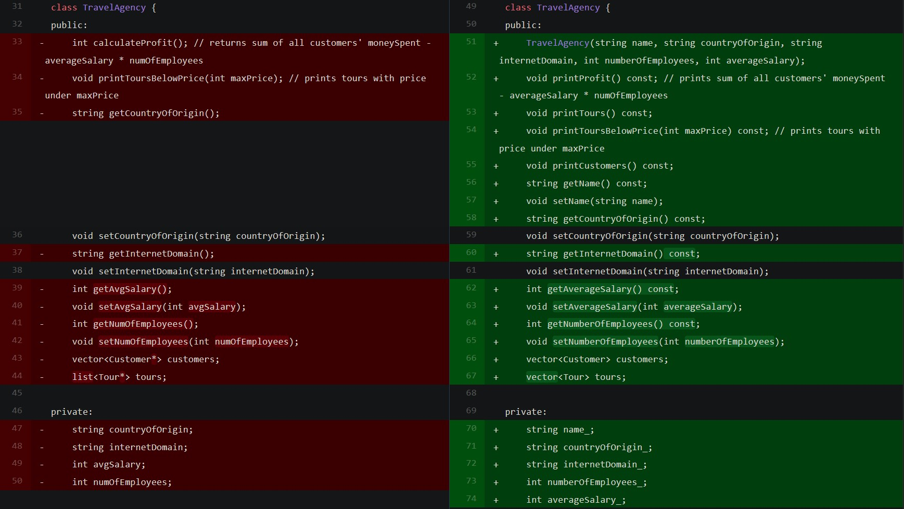
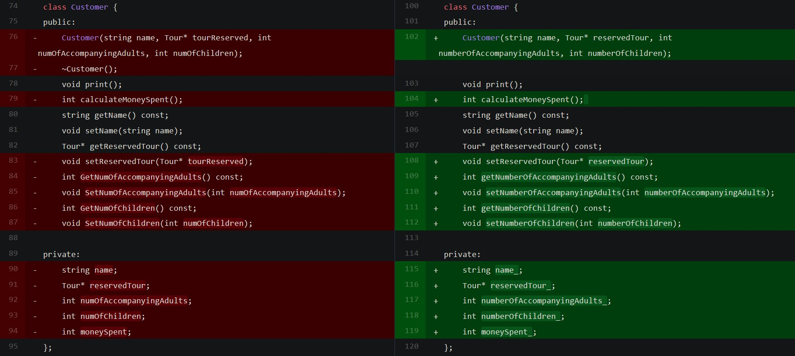
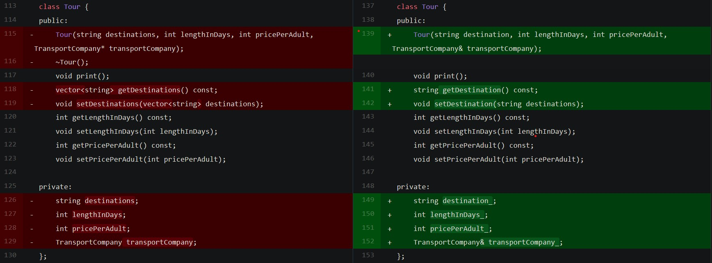

# Initial and current design compared

Let's take a look at how the preliminary plans for the project look next to the actual implementation of the code.

The screenshots presented are best viewed on a wide screen.
They are taken from [here](https://github.com/whiteeagle44/travel-agency/compare/fe097fa..36c443c).

## TravelAgency class

Originally the idea was that the main data containers of TravelAgency would be:

- vector of pointers to customers
- list of pointers to tours.



### Pointers

As it turned out, the use of pointers was unnecessary, therefore a change was introduced, as the vector elements were not to be modified directly with pointers but only through the STL vector interface.

### STL list to vector

A list of tours was changed to a vector of tours because the plan to order tours by price was abandoned. Given the aforementioned, the vector container seemed a more appropriate fit.

### Preliminary vs actual headers



As can be seen above, the method names were updated to keep consistency throughout the code. Moreover, a `const` keyword was added to all the methods that do not modify data.

A `printTours()` method was added that goes through each of the tours, invoking an internal `print()` method.

```cpp
    for (auto tour : tours) {
        tour.print();
    }
```

A `printCustomers()` method was added and implemented as well, for some reason omitted from the original project design. It works similarly to `printTours()`.

```cpp
    cout << "Printing customers: " << endl;
    for (auto customer : customers) {
        customer.print();
    }
```

### Other key function implementations

#### printProfit()

Prints sum of all customers' moneySpent - averageSalary \* numOfEmployees.

```cpp
void TravelAgency::printProfit() const
{
    cout << "Calculating profit: " << endl;
    cout << "Income: ";

    int moneySpent = 0;

    for (auto customer : customers) {
        moneySpent += customer.calculateMoneySpent();
        cout << customer.calculateMoneySpent() << "PLN from " << customer.getName() << ", ";
    }

    if (moneySpent == 0) {
        cout << "There are no customers";
    }
    cout << endl;
    cout << "Total income: " << moneySpent << "PLN" << endl;

    cout << "Expenses: " << averageSalary_ * numberOfEmployees_ << "PLN" << endl;

    int profit = moneySpent - averageSalary_ * numberOfEmployees_;

    if (profit < 0) {
        cout << "Expenses exceed profits, new customers needed urgently!" << endl;
    } else {
        cout << "Profit: " << profit << "PLN" << endl;
    }
}
```

#### printToursBelowPrice(int maxPrice)

Prints tours with price under maxPrice.

```cpp
void TravelAgency::printToursBelowPrice(int maxPrice) const
{
    cout << "Printing tours below " << maxPrice << "PLN: " << endl;
    for (auto tour : tours) {
        if (tour.getPricePerAdult() < maxPrice) {
            tour.print();
        }
    }
}
```

## Customer class

### calculateMoneySpent()

The original design for the implementation of this function looked as follows:

```cpp
    return (numOfAccompanyingAdults + 1) * &tourReserved->pricePerAdult + numOfChildren * &tourReserved->pricePerAdult * 0.5;
```

Although it was just a scheme, the final version of this function does not look very different:

```cpp
return (numberOfAccompanyingAdults_ + 1) * reservedTour_->getPricePerAdult()
        + numberOfChildren_ * reservedTour_->getPricePerAdult() * 0.5;
```

As mentioned before, the naming convention was updated. Also accessing the pointer to reserved tour was modified to be done appropriately.

### Changes to class headers

The class headers remained mostly the same with a destructor removed, as no dynamic space allocation was used.



## Tour class

### Pointer changed to reference

In the tour class, the constructor parameter was updated: a reference to transport company was put in place of a pointer. That is because, when given a choice, using a reference seems to be [recommended](https://stackoverflow.com/a/7058373).

### Destination stored as a string of text

Tour destinations while originally designed to be stored in a vector of strings are now simply in a string. That is in order not to overcomplicate simple things, as the usage of vector would not be beneficial in this case.



### print()

The notable function in this class does exactly what the name suggests:

```cpp
    cout << "Destination: " << destination_ << ", length: " << lengthInDays_ << " days, price per adult: "<< pricePerAdult_ << "PLN, transport: " << transportCompany_.getStandard() << " company " << transportCompany_.getName() << endl;
```

## TransportCompany classes

The headers of these remained mostly the same.
`Constant string TYPE` was added to each of the children, simply in order to be able to print each of these object along with its type as can be observed in this main function excerpt:

```cpp
    cout << Lot.getName() << " is a " << Lot.getStandard() << " " << Lot.TYPE << endl;
```

## Raw data of project changes

The raw data of original design side to side with the current description of the project can be seen in detail at [this link](https://github.com/whiteeagle44/travel-agency/compare/fe097fa..36c443c).
